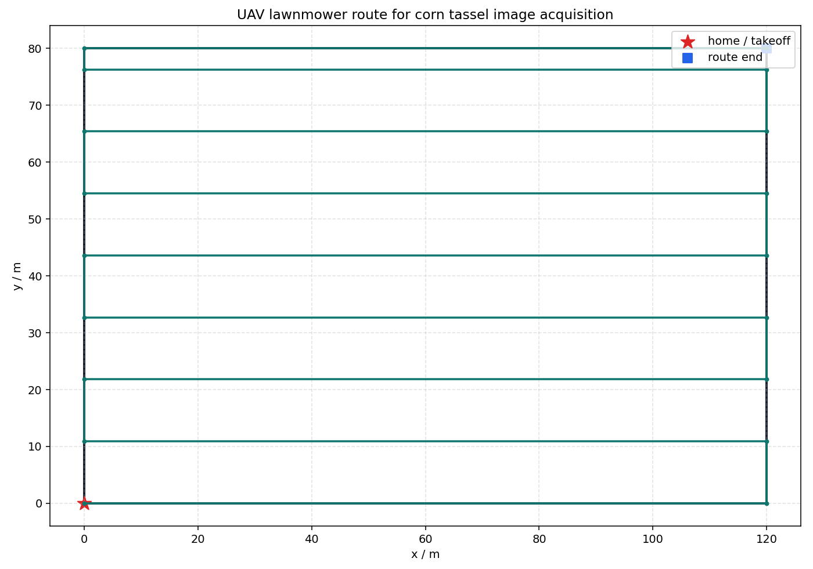

# 基于 Faster R-ViT 的玉米雄穗检测系统：复现、修复与无人机规划接入记录

日期：2026-06-06  
项目目录：`/home/o_mabin/LLM/nnscaler-clj/gem5/fasterrvit/simple`

这次目标不是只“看一眼代码”，而是把这个 `simple` 项目整理到能跑、能留下结果、能讲清楚下一步怎么接无人机规划的状态。最后产物包括：项目虚拟环境、代码修复、数据和模型烟测、标注截图、无人机航线规划图、运行日志，以及加入无人机规划内容的新版立项书。

## 1. 我先遇到的真实问题

项目原始结构是 `simple-faster-rcnn-pytorch` 风格，数据采用 VOC2007 格式，任务标签是玉米雄穗 `pith`。但直接复现会卡住几个地方：

- 系统 `python3` 没有安装 `torch`。
- 项目代码里存在 Windows 绝对路径，例如 `D:/hpc/simple/VOCdevkit/VOC2007`。
- 数据集实际只有 1 个类别 `pith`，但模型默认 `n_fg_class=20`。
- 多处代码硬编码 `.cuda()`，当前虚拟环境里 `torch.cuda.is_available()` 为 `False`。
- `np.bool` 在新版本 NumPy 中不再可用。
- 原始 `.doc` 立项书需要先转换为 `.docx` 才能可靠编辑。

这些不是理论问题，都是运行时会撞上的小石头。修完以后，项目至少可以完成数据读取、标注可视化、模型构建、RPN 前向和单步训练烟测。

## 2. 虚拟环境

我在项目目录下创建了专用虚拟环境：

```bash
/home/o_mabin/miniconda/envs/nns/bin/python -m venv --system-site-packages .venv_fasterrvit
.venv_fasterrvit/bin/python -m pip install torchvision==0.17.0 scikit-image tqdm fire matplotlib ipdb torchnet visdom einops python-docx defusedxml
```

关键版本：

```text
Python 3.10.20
torch 2.2.0+cu121
torchvision 0.17.0+cu121
scikit-image 0.25.2
matplotlib 3.10.8
python-docx 1.2.0
```

环境日志：`../logs/environment_setup.log`

注意：主机 `nvidia-smi` 能看到 4 张 A100，但这次运行中 `torch.cuda.is_available()` 为 `False`，所以复现脚本自动走 CPU。

## 3. 代码修复

主要修复点：

- `utils/config.py`：加入项目根目录、相对 VOC 路径、输出目录、`n_fg_class=1`、ViT 权重路径。
- `data/voc_dataset.py`：修掉 Windows 绝对路径，修复 `np.bool`，把标签改成真正的单元素 tuple。
- `utils/array_tool.py`：`totensor(..., cuda=True)` 改成只有 CUDA 可用时才 `.cuda()`。
- `model/utils/creator_tool.py`、`model/faster_rcnn.py`、`trainer.py`、`train.py`：把硬编码 CUDA 调整为按设备运行。
- `model/faster_rcnn_vgg16原.py`：默认类别数改为读取配置，并避免自动下载 VGG 权重。
- `utils/vis_tool.py`：标签列表收敛为本任务的 `pith`。

新增脚本：

- `scripts/reproduce_simple.py`：数据统计、标注截图、模型 RPN 烟测。
- `scripts/plan_uav_mission.py`：生成无人机往复式覆盖航线。
- `scripts/create_uav_proposal_docx.py`：生成加入无人机航线规划内容的新版立项书。

## 4. 数据集检查结果

运行命令：

```bash
.venv_fasterrvit/bin/python scripts/reproduce_simple.py --output-dir repro_outputs
```

核心统计：

```text
annotation_files: 320
image_files: 320
trainval_count: 160
test_count: 159
label_names: ["pith"]
objects_total: 9437
objects_per_image_mean: 29.49
objects_per_image_max: 84
image_width_range: 3456-4272
image_height_range: 2304-2848
missing_images: ["334.jpg"]
```

完整 JSON：`dataset_stats.json`

有一个数据质量点：XML 中引用了 `334.jpg`，但图片缺失。当前样例复现不受影响，但正式训练前建议修复划分或补齐图片。

## 5. 标注截图

脚本生成了样例 `10` 的玉米雄穗标注图：


这张图说明 VOC XML 的坐标解析正常，`pith` 标签能正确画出来。

## 6. 模型烟测结果

复现脚本把输入缩放到较小尺寸，只做模型构建、VGG 特征提取和 RPN 前向，避免在 CPU 上跑完整长训练。

运行结果：

```text
device: cpu
input_shape: [1, 3, 192, 256]
feature_shape: [1, 512, 12, 16]
rpn_locs_shape: [1, 1728, 4]
rpn_scores_shape: [1, 1728, 2]
rois_shape: [160, 4]
anchors_shape: [1728, 4]
n_fg_class: 1
elapsed_seconds: 5.675
```

完整日志：`../logs/run_reproduction.log`  
完整汇总：`reproduction_summary.json`

我还额外跑了一次单步训练烟测，训练链路可以返回 loss：

```text
rpn_loc_loss=2.641688108444214
rpn_cls_loss=0.6981668472290039
roi_loc_loss=1.5350521209711587e-07
roi_cls_loss=0.675297737121582
total_loss=4.015152931213379
```

训练烟测时 Visdom 打印了 localhost 连接警告，因为沙箱里没有启动 visdom server；这不影响 loss 返回。正式训练时建议先启动：

```bash
.venv_fasterrvit/bin/python -m visdom.server
```

## 7. 无人机航线规划

新增的无人机规划脚本把项目从“图像检测”扩展成“采集-检测-定位-作业建议”的闭环。

运行命令：

```bash
.venv_fasterrvit/bin/python scripts/plan_uav_mission.py --output-dir repro_outputs
```

默认参数：

```text
field_width_m: 120
field_height_m: 80
flight_height_m: 25
camera_fov_deg: 72
side_overlap: 0.7
speed_mps: 4
```

输出结果：

```text
line_spacing_m: 10.898
waypoint_count: 18
route_length_m: 1160.0
estimated_duration_s: 290.0
```

航线图：



这个模块当前是一个可解释的原型：根据田块矩形边界、飞行高度、相机视场角和旁向重叠率生成往复式航线。下一步可以把矩形扩展成任意多边形田块，并把每张图片的 GPS/北斗信息接入检测结果，生成雄穗密度热力图。

## 8. 立项书更新

原始文件是 `.doc`，先用 LibreOffice 转为 `.docx`，再通过脚本加入无人机规划内容。新版没有覆盖原文件，输出为：

```text
repro_outputs/reports/立项书_加入无人机航线规划版.docx
```

新增内容覆盖：

- 项目名称：加入“无人机航线规划”。
- 项目简介：加入田块边界建模、覆盖航线、低空图像采集、检测结果空间映射、去雄路径规划闭环。
- 研究内容：新增“无人机巡检航线规划与检测结果空间映射研究”。
- 技术路线：新增航线生成、图像-航点绑定、热力图输出、复飞验证。
- 预期成果：新增航线规划模块和田块网格级雄穗分布图。

文档校验结果：

```text
All validations PASSED!
```

## 9. 当前交付物清单

```text
repro_outputs/logs/environment_setup.log
repro_outputs/logs/run_reproduction.log
repro_outputs/reports/dataset_stats.json
repro_outputs/reports/reproduction_summary.json
repro_outputs/reports/uav_mission_plan.json
repro_outputs/reports/立项书_加入无人机航线规划版.docx
repro_outputs/screenshots/sample_gt_boxes.png
repro_outputs/screenshots/uav_route_plan.png
```

## 10. 后续建议

现在项目已经从“跑不起来的拷贝”推进到“能复现关键链路并留下证据”的状态。后续要做正式实验，我建议按这个顺序：

1. 修复 `334.jpg` 缺失或从划分中删除对应样本。
2. 启动 Visdom 或把训练可视化改成离线日志。
3. 在 GPU 可用的环境里跑完整训练。
4. 明确 Faster R-ViT 的 ViT backbone 输出尺寸，目前可复现链路使用的是稳定的 VGG16 Faster R-CNN 路线。
5. 把无人机航线规划从矩形田块扩展到真实田块边界，并接入 GPS/北斗坐标。
