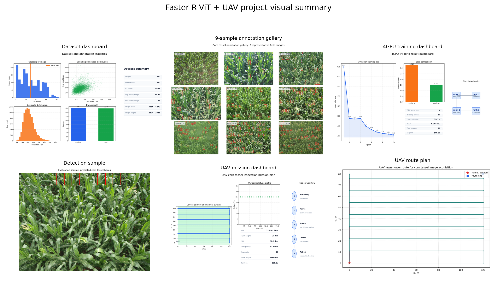
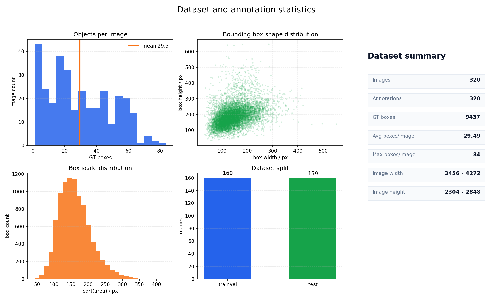
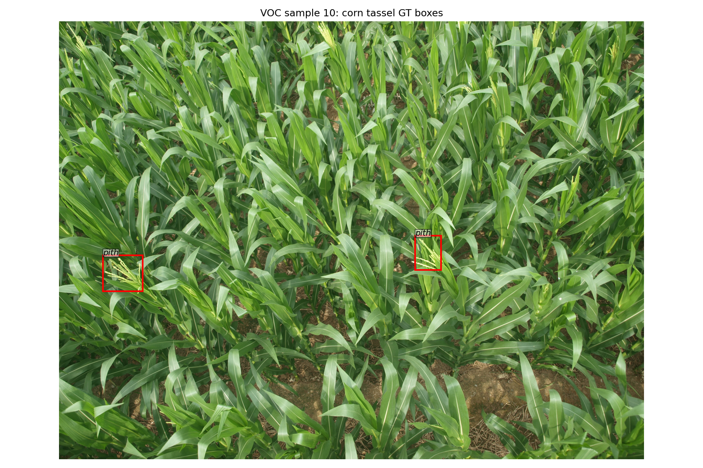
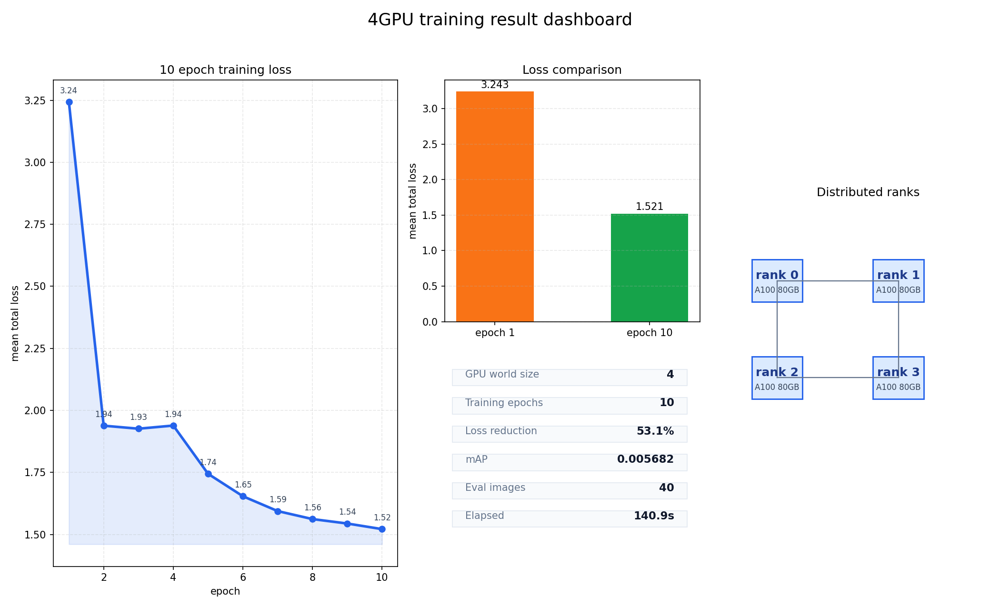
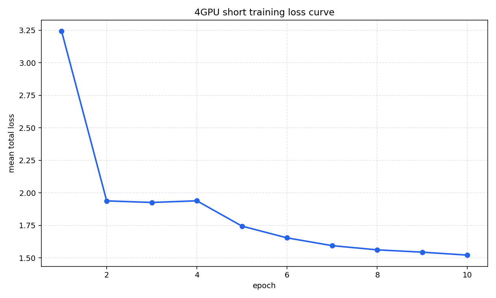
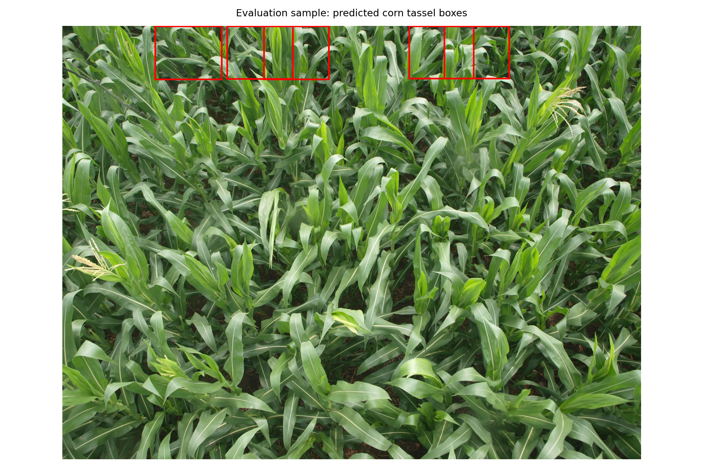
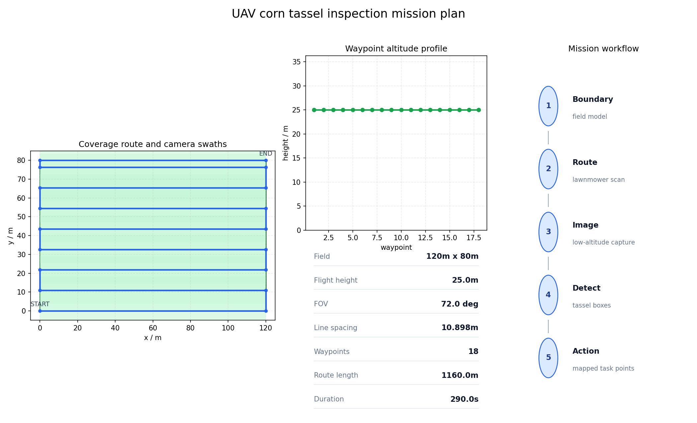

# 基于 Faster R-ViT 与无人机规划的玉米雄穗检测系统复现报告

日期：2026-06-06  
项目目录：`/home/o_mabin/LLM/nnscaler-clj/gem5/fasterrvit/simple`

## 1. 复现目标

本次复现围绕玉米雄穗目标检测系统展开，完成了数据集检查、4GPU 短周期训练、模型评估、检测结果可视化以及无人机巡检航线规划。训练轮数设置为 `10` epoch，目标是验证项目流程完整性、代码可运行性和系统展示效果，不以最终精度作为唯一评价指标。

## 2. 运行环境

| 项目 | 结果 |
|---|---|
| Python/PyTorch 环境 | `.venv_fasterrvit` |
| 训练 GPU 数量 | `4` |
| GPU 型号 | `NVIDIA A100 80GB PCIe, NVIDIA A100 80GB PCIe, NVIDIA A100 80GB PCIe, NVIDIA A100 80GB PCIe` |
| 训练耗时 | `140.906` 秒 |
| 模型类别数 | `1` 类，玉米雄穗 `pith` |

4GPU 启动命令如下：

```bash
CUDA_VISIBLE_DEVICES=0,1,2,3 .venv_fasterrvit/bin/python -m torch.distributed.run \
  --nproc_per_node=4 \
  scripts/train_4gpu_short.py \
  --epochs 10 \
  --output-dir repro_outputs/4gpu_train
```

## 3. 脚本运行流程与输出对应关系

本项目按“环境确认、数据检查、4GPU 训练、无人机规划、可视化素材生成、报告汇总”的顺序执行。各脚本与输出结果的对应关系如下。

| 步骤 | 运行命令 | 主要输出 |
|---|---|---|
| 1. 检查 4GPU 环境 | `CUDA_VISIBLE_DEVICES=0,1,2,3 .venv_fasterrvit/bin/python -c "import torch; print(torch.cuda.is_available(), torch.cuda.device_count())"` | 确认 CUDA 可用，GPU 数量为 `4` |
| 2. 数据集检查与样例标注 | `.venv_fasterrvit/bin/python scripts/reproduce_simple.py --output-dir repro_outputs` | `dataset_stats.json`、`sample_gt_boxes.png`、基础复现日志 |
| 3. 4GPU 训练与评估 | `CUDA_VISIBLE_DEVICES=0,1,2,3 .venv_fasterrvit/bin/python -m torch.distributed.run --nproc_per_node=4 scripts/train_4gpu_short.py --epochs 10 --output-dir repro_outputs/4gpu_train` | 训练日志、rank 日志、模型权重、loss 曲线、评估指标 |
| 4. 重新渲染检测样例 | `CUDA_VISIBLE_DEVICES=0 .venv_fasterrvit/bin/python scripts/render_trained_detection.py --train-dir repro_outputs/4gpu_train --max-images 40` | `eval_detection_sample.png`，展示训练后模型推理结果 |
| 5. 生成无人机航线规划 | `.venv_fasterrvit/bin/python scripts/plan_uav_mission.py --output-dir repro_outputs/4gpu_train` | `uav_mission_plan.json`、`uav_route_plan.png` |
| 6. 生成综合展示图 | `.venv_fasterrvit/bin/python scripts/create_teacher_visuals.py --train-dir repro_outputs/4gpu_train` | 9宫格样例、数据集面板、训练面板、无人机任务面板、教师展示总拼图 |
| 7. 生成教师展示报告 | `.venv_fasterrvit/bin/python scripts/create_teacher_report.py --train-dir repro_outputs/4gpu_train --output repro_outputs/reports/FasterRVIT_UAV_教师展示版复现报告.md` | 当前 Markdown 报告 |
| 8. 生成新版立项书 | `.venv_fasterrvit/bin/python scripts/create_uav_proposal_docx.py` | `立项书_加入无人机航线规划版.docx` |

其中，训练脚本 `scripts/train_4gpu_short.py` 会在 rank 0 进程中统一保存训练日志、模型权重、loss 曲线和评估指标；`rank_0.log` 至 `rank_3.log` 用于记录 4 个分布式进程实际参与训练的情况。可视化脚本 `scripts/create_teacher_visuals.py` 不重新训练模型，只读取已生成的指标、航线和图像结果，再组合生成用于展示的图表。

主要图片的生成来源如下。

| 图片 | 生成脚本 | 数据来源 | 展示目的 |
|---|---|---|---|
| `sample_gt_boxes.png` | `scripts/reproduce_simple.py` | VOC 标注 XML 与原始图像 | 展示单张图像的真实标注框 |
| `annotation_gallery_9.png` | `scripts/create_teacher_visuals.py` | 320 张图像的标注统计 | 展示不同目标密度下的 9 张代表性样例 |
| `dataset_dashboard.png` | `scripts/create_teacher_visuals.py` | `dataset_stats.json` 与 XML 标注 | 展示数据量、目标数量、框尺度分布和数据集划分 |
| `loss_curve.png` | `scripts/train_4gpu_short.py` | 10 epoch 训练日志 | 展示 loss 随训练轮次下降的过程 |
| `training_dashboard.png` | `scripts/create_teacher_visuals.py` | `train_metrics.json` | 汇总 4GPU、loss、mAP 和训练耗时 |
| `eval_detection_sample.png` | `scripts/render_trained_detection.py` | 训练后模型权重与测试图像 | 展示模型推理得到的雄穗预测框 |
| `uav_route_plan.png` | `scripts/plan_uav_mission.py` | 田块尺寸、飞行高度、视场角、重叠率 | 展示无人机往复式覆盖航线 |
| `uav_mission_dashboard.png` | `scripts/create_teacher_visuals.py` | `uav_mission_plan.json` | 展示覆盖航带、航点高度、规划参数和任务流程 |
| `teacher_display_montage.png` | `scripts/create_teacher_visuals.py` | 上述各类图像结果 | 汇总形成教师展示用总拼图 |

## 4. 可视化总览

下图汇总了数据集统计、样例标注、4GPU 训练曲线、检测结果和无人机巡检规划，便于快速展示本次复现的主要输出。



## 5. 数据集检查

| 指标 | 数值 |
|---|---:|
| 图像数量 | 320 |
| 标注文件数量 | 320 |
| 训练集数量 | 160 |
| 测试集数量 | 159 |
| 雄穗标注总数 | 9437 |
| 单图平均雄穗数 | 29.4906 |
| 单图最大雄穗数 | 84 |

数据集统计面板如下：



9 张代表性样例标注如下，用于展示数据中玉米雄穗目标数量、尺度和画面密度的变化：


样例标注可视化如下，红框表示标注出的玉米雄穗区域：



## 6. 4GPU 训练结果

本次训练采用 4GPU 分布式短训练方式，每个 GPU 处理训练集的一个数据切片，并在每次反向传播后同步平均梯度。训练共完成 `10` 个 epoch。

| 指标 | 数值 |
|---|---:|
| 初始 epoch 平均 total loss | 3.242924 |
| 最终 epoch 平均 total loss | 1.521377 |
| 评估图像数量 | 40 |
| mAP | 0.005682 |

训练结果综合面板如下：



训练 loss 曲线如下：



训练日志保存于：`../4gpu_train/logs/train_4gpu_10epoch.log`

模型权重保存于：`../4gpu_train/checkpoints/fasterrcnn_4gpu_10epoch.pth`

## 7. 检测结果展示

训练结束后，使用测试集样例进行检测可视化。由于本次训练周期较短，检测效果主要用于展示完整推理流程。



检测样例中展示预测框数量：`5`  
检测样例最高置信度：`0.314878`

## 8. 无人机航线规划

在检测系统基础上，项目加入无人机巡检规划模块。默认设置田块尺寸为 `120.0m x 80.0m`，飞行高度 `25.0m`，相机视场角 `72.0°`，旁向重叠率 `0.7`。

| 指标 | 数值 |
|---|---:|
| 航线间距 | 10.898 m |
| 航点数量 | 18 |
| 航程估计 | 1160.0 m |
| 飞行时间估计 | 290.0 s |

无人机任务规划面板如下，包含覆盖航带、航点高度、关键参数和系统流程：



无人机往复式覆盖航线如下：


## 9. 立项书更新

已生成加入无人机航线规划内容的新版立项书：

`立项书_加入无人机航线规划版.docx`

新版文档增加了田块边界建模、覆盖式航线规划、低空图像采集、检测结果空间映射、去雄作业路径规划等内容，并已通过 `.docx` 校验。

## 10. 输出文件

| 文件 | 说明 |
|---|---|
| `../4gpu_train/logs/train_4gpu_10epoch.log` | 4GPU 训练日志 |
| `../4gpu_train/logs/nvidia_smi_before.txt` | 训练前 GPU 状态 |
| `../4gpu_train/logs/nvidia_smi_after.txt` | 训练后 GPU 状态 |
| `../4gpu_train/reports/train_metrics.json` | 训练与评估指标 |
| `../4gpu_train/screenshots/loss_curve.png` | loss 曲线 |
| `../4gpu_train/screenshots/eval_detection_sample.png` | 检测样例 |
| `../4gpu_train/screenshots/uav_route_plan.png` | 无人机航线图 |
| `../4gpu_train/screenshots/teacher_display_montage.png` | 教师展示总拼图 |
| `../4gpu_train/screenshots/annotation_gallery_9.png` | 9宫格标注样例 |
| `../4gpu_train/screenshots/dataset_dashboard.png` | 数据集统计面板 |
| `../4gpu_train/screenshots/training_dashboard.png` | 4GPU 训练结果面板 |
| `../4gpu_train/screenshots/uav_mission_dashboard.png` | 无人机任务规划面板 |

## 11. 结论

本次复现完成了从数据读取、模型训练、模型评估、结果可视化到无人机规划展示的完整流程。4GPU 短训练能够正常完成，项目具备继续开展长周期训练、精度优化和无人机实地采集闭环扩展的基础。
